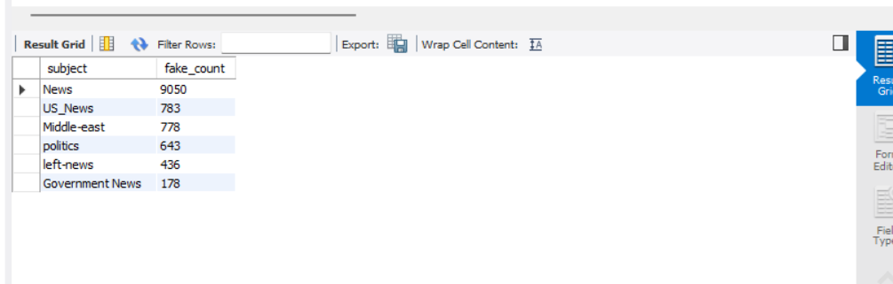

# Fake News Detection & Analysis Dashboard

## 📌 Project Overview

The Fake News Detection & Analysis project is a data analytics project developed using Python, MySQL, and Power BI. The project focuses on analyzing fake and real news datasets to identify trends, subject distributions, and monthly news patterns through data preprocessing, SQL analysis, and interactive dashboard visualization.

This project demonstrates practical skills in:
- Data Cleaning
- Exploratory Data Analysis (EDA)
- SQL Database Management
- Data Visualization
- Dashboard Development

---

# 🛠️ Technologies Used

- Python
- Pandas
- Matplotlib
- MySQL
- Power BI
- VS Code

---

# 📂 Project Structure

```plaintext
FakeNewsDetectionProject/
│
├── data/
│   ├── Fake.csv
│   ├── True.csv
│   └── cleaned_news.csv
│
├── python/
│   ├── analysis.py
│   └── test.py
│
├── sql/
│   └── sql_queries.sql
│
├── powerbi/
│   └── FakeNewsDashboard.pbix
│
├── screenshots/
│   ├── dashboard_overview.png
│   ├── sql_output.png
│   ├── fake_vs_real_news_count.png
│   ├── fake_news_by_subject.png
│   ├── news_trend_over_months.png
│   └── fake_vs_real_news_trend.png
│
├── README.md
├── requirements.txt
└── .gitignore

---

# 📊 Features

- Fake vs Real News Analysis
- Subject-wise Fake News Analysis
- Monthly News Trend Analysis
- SQL-based Data Analysis
- Interactive Power BI Dashboard
- Data Cleaning & Preprocessing
- Data Visualization using Matplotlib

---

# 🐍 Python Analysis

The Python part of the project performs:
- Data loading using Pandas
- Data preprocessing and cleaning
- Fake and Real news classification
- Subject-wise analysis
- Monthly trend analysis
- Graph generation using Matplotlib

### Graphs Generated
- Fake vs Real News Count
- Fake News by Subject
- News Trend Over Months
- Fake vs Real News Trend

---

# 🗄️ SQL Analysis

The project uses MySQL Workbench for storing and analyzing news data.

### SQL Operations Performed
- Database Creation
- Table Creation
- Data Insertion using Python
- Data Analysis using SQL Queries

### Example SQL Queries

```sql
SELECT news_type, COUNT(*)
FROM news_data
GROUP BY news_type;
```

```sql
SELECT subject, COUNT(*) AS fake_count
FROM news_data
WHERE news_type='Fake'
GROUP BY subject
ORDER BY fake_count DESC;
```

---

# 📈 Power BI Dashboard

The Power BI dashboard provides interactive visualization and insights from the dataset.

### Dashboard Includes
- Total News Count
- Fake News Count
- Real News Count
- Fake News Percentage
- Monthly News Trends
- Subject-wise Analysis
- Interactive Filters & Visuals

---

# ▶️ How to Run the Project

## 1️⃣ Install Required Libraries

```bash
pip install -r requirements.txt
```

---

## 2️⃣ Run Python Analysis

Open terminal inside `python/` folder and run:

```bash
python analysis.py
```

---

## 3️⃣ Run SQL Queries

Open MySQL Workbench and execute queries from:

```plaintext
sql/sql_queries.sql
```

---

## 4️⃣ Open Power BI Dashboard

Open:

```plaintext
powerbi/FakeNewsDashboard.pbix
```

using Power BI Desktop.

---

# 📸 Project Screenshots

## Dashboard Overview


---

## SQL Output



---

# 🚀 Future Improvements

- Machine Learning based Fake News Prediction
- NLP Integration
- Real-time News Detection
- Streamlit Web Application
- Sentiment Analysis

---

# 👩‍💻 Author

Pranali Sakle

Computer Engineering Student  
Interested in Data Analytics, Python, SQL, and Power BI